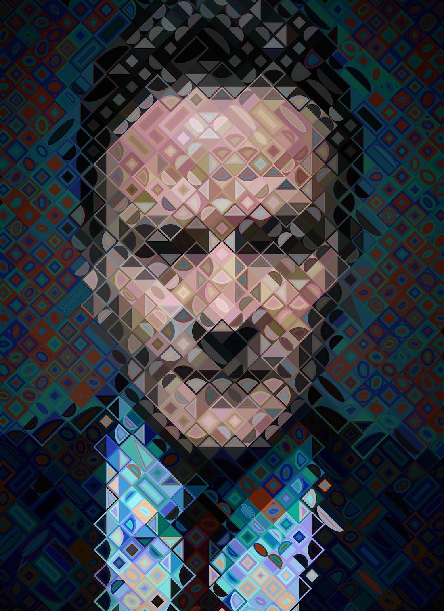

# Mosaic Shapes

 
 



```console
$ python run.py ./input/bryan.jpg -e 2000 -d -c 1; open /tmp/out.jpg

$ python run.py -h
usage: run.py [-h] [-d] [-c {0,1,2}] [-a] [-r WORKING_RES] [-e ENLARGE]
              [-m MULTI] [-p POOL] [-o OUT]
              N [N ...]

Mosaic photos

positional arguments:
  N                     Photo path
optional arguments:
  -h, --help            show this help message and exit
  -d, --diamond         Use diamond grid instead of squares
  -c {0,1,2}, --color {0,1,2}
                        Specify color values
  -a, --analogous       Use analogous color
  -r WORKING_RES, --working_res WORKING_RES
                        Resolution to sample from
  -e ENLARGE, --enlarge ENLARGE
                        Resolution to draw
  -m MULTI, --multi MULTI
  -p POOL, --pool POOL
  -o OUT, --out OUT
```

## FastApi

```console
cd app
uvicorn main:app --host 127.0.0.1 --port 9001
```

## Docker cheatsheet

You should know this already...

### Image Building

```console
docker build -t mosaicshapes . --no-cache 
docker build -t mosaicshapes . 
clear; docker build -t mosaicshapes . ; docker image prune -f ; docker images 
```

### Container Running

```console
docker run --rm -it --entrypoint bash mosaicshapes   
docker container run --rm -it -p 8080:80 mosaicshapes 

docker exec -it CONTAINER_ID /bin/bash
docker exec -it $(docker container ls -q --last 1) /bin/bash
```

### Cleanup 
Probably better to avoid the need for cleanup with ```--rm``` option for containers and ```prune``` for images

```console
docker ps -aq  
docker rm $(docker ps -aq)
docker image rm <image-id>
docker image prune
```


{
   "3cb1f9055d3b4e6a87d04196213b7035": "{\n    \"aborted\": false,\n    \"args\": {\n        \"temp\": \"/tmp/tmpz0uj5dt7.jpg\",\n        \"uid\": \"3cb1f9055d3b4e6a87d04196213b7035\",\n        \"url\": \"aHR0cHM6Ly9tLm1lZGlhLWFtYXpvbi5jb20vaW1hZ2VzL1AvMTkwOTI2Mzc4OC4wMS5fU0NMWlpaWlpaWl9TWDUwMF8uanBn\"\n    },\n    \"delta_ms\": 1676330674595,\n    \"expired\": false,\n    \"finish_ms\": 1676330674594,\n    \"fn\": {},\n    \"name\": \"createMosaic\",\n    \"output\": \"/tmp/out-3cb1f9055d3b4e6a87d04196213b7035.jpg\",\n    \"result\": 0,\n    \"start_ms\": -1,\n    \"temp\": \"/tmp/tmpz0uj5dt7.jpg\",\n    \"uid\": \"3cb1f9055d3b4e6a87d04196213b7035\"\n}",
   "6028d78ea4104c9b992afcf0ce1b8945": "{\n    \"aborted\": false,\n    \"args\": {\n        \"temp\": \"/tmp/tmpy3yl6y7v.jpg\",\n        \"uid\": \"6028d78ea4104c9b992afcf0ce1b8945\",\n        \"url\": \"aHR0cHM6Ly9tLm1lZGlhLWFtYXpvbi5jb20vaW1hZ2VzL1AvMTkwOTI2Mzc4OC4wMS5fU0NMWlpaWlpaWl9TWDUwMF8uanBn\"\n    },\n    \"delta_ms\": -1,\n    \"expired\": false,\n    \"finish_ms\": -1,\n    \"fn\": {},\n    \"name\": \"createMosaic\",\n    \"output\": null,\n    \"result\": null,\n    \"start_ms\": -1,\n    \"temp\": \"/tmp/tmpy3yl6y7v.jpg\",\n    \"uid\": \"6028d78ea4104c9b992afcf0ce1b8945\"\n}"
}
